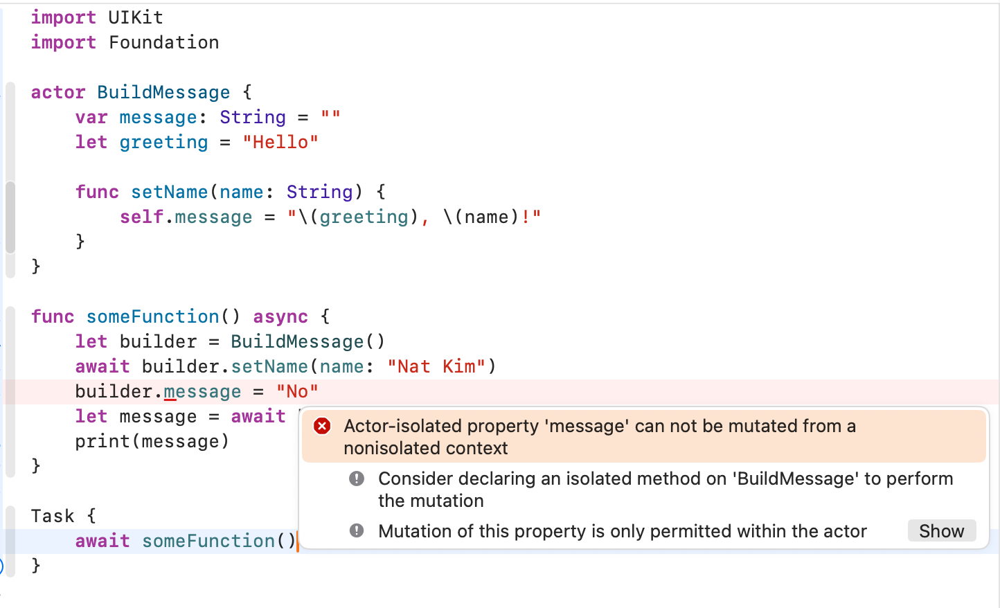

# 동시성과 데이터 격리

액터 인스턴스에 포함된 데이터는 앱의 다른 코드와 격리된다.

격리(isolation): 인스턴스 데이터를 변경하는 메서드가 호출될 때, **다른 곳의 코드에서 해당 메서드를 호출할 수 있게 되기 전에 메서드가 완전히 실행되는 것을 보장**한다. 

이렇게 하면 **여러 작업이 동시에 데이터 변경을 시도하는 것을 방지**할 수 있다.

- 코드가 액터의 가변적인 내부 속성을 직접 변경하는 것을 방지


```
Actor-isolated property 'message' can not be mutated from a nonisolated context
// 가변적인 속성에 접근하지 않는 액터 메서드는 nonisolated 키워드를 사용하여 격리에서 제외시킬 수 있다. 
```



Mutation of this property is only permitted within within the actor.

(이 프로퍼티의 변경은 액터 내부에서만 허용된다.)

Actor-isolated property 'message' can not be mutated from a nonisolated context

(격리된 액터 프로퍼티 'message'는 격리되지 않은 컨텍스트에서 변경될 수 없다)

- 기본적으로 액터 내 모든 메서드와 가변적 속성은 격리된 것으로 간주
- await 키워드를 통해서만 호출


### non-isolated

```swift
actor BuildMessage {
	var message: String = ""
	let greeting = "Hello"
	
	func setName(name: String) {
		self.message = "\(greeting), \(name)!"
	}
	
	nonisolated func getGreeting() -> String {
		return greeting
	}
}
```

액터 메서드는 `nonisolated` 키워드를 사용하고 

- 격리에서 제외시킬 수 있다.
- 이 방식으로 선언되면 await 키워드 없이 메서드를 호출
- 동기 코드에서도 호출할 수 있다.

```swift
let builder = BuildMessage()

func asyncFunction() async {
// 불변 속성 -> await가 필요없다
	let greeting = builder.getGreeting()
	print(greeting)
}

```

격리에서 제외된 nonisolated 
- 일부 변수 속성 설정 오류 var greeting → let greeting으로 해야함.불변 속성이어야 await 키워드를 붙이지 않아도 됨 

> nonisolated 사용 사례
> 
- 계산 전용 메서드: 상태 변경 없이 계산만
- 상수 반환 `let` 속성 값 반환
- 유틸리티 함수: Actor 상태와 무관한 헬퍼 함수
- 프로토콜 준수: 동기 메서드가 필요한 프로토콜 구현

성능상 이점: 

- Actor 큐를 거치지 않아서 더 빠름
- 동기적 실행으로 오버헤드 없음

안정성 보장

- 컴파일러가 data race 가능성을 사전 차단
- 안전한 접근만 허용하여 동시성 버그 방지
- nonisolated 는 Actor의 보호가  필요 없다 라는 걸 컴파일러에게 알려주는 키워드

> 출처
- 핵심만 골라 배는 SwiftUI기반 iOS 프로그래밍
- claude 정리