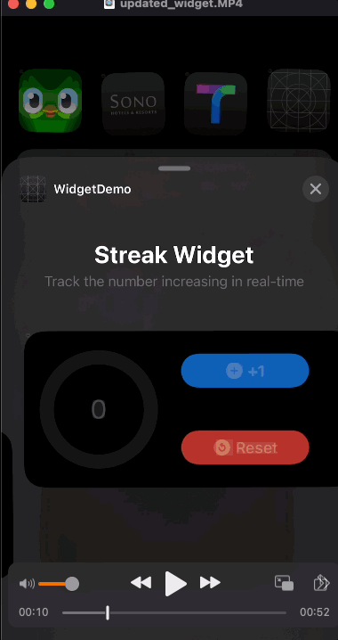

## WidgetKit App Intent Configuration 
(앱 위젯 구성 설정)
> Xcode 버전, SwiftUI 버전 유의사항
교재의 책은 Xcode 14, iOS 15 쯤 되어 몇년 전 정보라 할 수 있다. 그래서 공식 문서를 살펴보면서 

현재 그나마 최신의 내용으로 타겟팅을 맞춰야한다. iOS 17.0+ 로 맞춰야한다.

기본적으로 `WidgetKit` 의 *Widget Configuration* 은 기존에 Static(정적)으로 설정했다면, App Intent Configuration은 개발자나 기획에 따라 구성 옵션을 자유롭게 설정할 수 있다. 

1. 구성 옵션 추가하기 
- 인텐트 정의 구성하기
- 위젯 수정하기
- 위젯 구성 테스트하기
- 구성 인텐트 UI 커스터마이징하기

1. intentdefinition 파일 직접 추가  → 이건 사실상 지금 쓰이지 않는다고 보면 된다. 코드로서 추가하고 struct(구조체 타입으로 `WidgetConfigurationIntent` 을 따로 정의해 widgetKit 을 설정한 핵심 파일 내 
    - AppIntentTimelineProvider
    - TimelineEntry - 정의에도 WidgetConfigurationIntent 를 설정해줬던 것을 추가 구성 요소로 넣어준다.
    - WidgetKit의 UI 를 담당하는 EntryView에서 자유롭게 위젯의 구성을 설정해준다.
- 요약: 인텐트 구성 유형 - 정적 구성 반대
    - 시리킷 인텐트 정의 파일 내엣 ㅓ인텐트와 매개변수 설정 → 사용자가 구성 옵션을 사용할 수 있게 한다.
    - Provider getTimeline() 메서드가 호출될 때마다 위젯킷은 구성 인텐트 객체의 복사본을 전달, 객체의 매개변수는 사용자의 기본 설정과 일치하도록 결과 타임라인을 조정하는데 사용할 수 있다.

iOS 14+

https://developer.apple.com/documentation/widgetkit/intentconfiguration

iOS 17+ 

https://developer.apple.com/documentation/widgetkit/appintentconfiguration

시스템적 버그 메시지지만, 실상 디바이스상에서 위젯을 설치해 테스트해보는 것에는 이상이 없다.

아래는 실제 구동되는 테스트 화면이다. 앱 화면에서 바뀌는 숫자를 바로 
위젯에서도 적용이 되는 것을 볼 수 있으며 위젯상에서 숫자를 목표치에 
도달하면 멈추는 UI를 확인할 수 있다.

### 위젯 업데이트
1. 사용자가 목표달성시 목표 완료라는 문구와 버튼 비활성화
2. 리셋버튼 추가

 